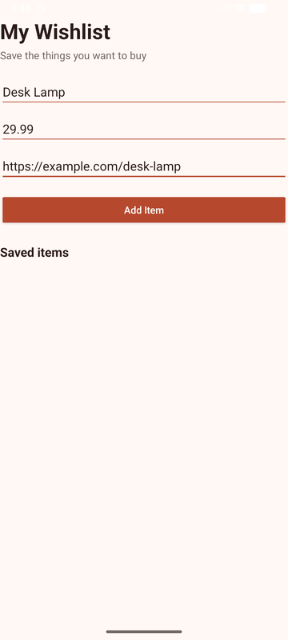

# Wishlist

Wishlist is a native Android app for keeping track of items you want to buy. Add an item name, price, and URL to build a scrolling list for the current session.

## Demo



## Features

- Adds validated wishlist entries with a name, price, and URL.
- Displays items in a scrolling `RecyclerView`.
- Opens an item's URL when its row is tapped.
- Removes an item after a long-press confirmation.

## Run locally

1. Open the project in Android Studio.
2. Sync Gradle and select an Android emulator or connected device.
3. Run the `app` configuration.

## Verification

```powershell
.\gradlew.bat testDebugUnitTest assembleDebug
```

The repository also runs the same unit-test and debug-build gate through GitHub Actions on pull requests and pushes to `main`.
